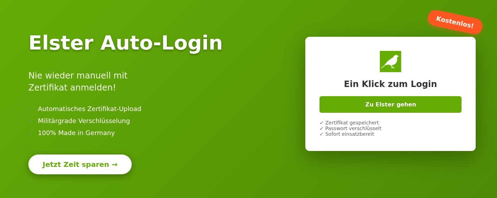
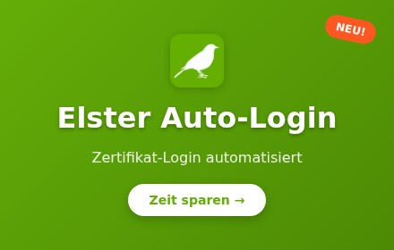

# Elster Auto-Login Extension

Eine Chrome-Extension, die das Login bei Elster (elster.de) mit Zertifikatsdatei automatisiert.

## ✨ Features

- 🔐 **Automatisches Zertifikat-Upload** - Nie wieder manuell die .pfx-Datei auswählen
- 🔒 **Sicher verschlüsselt** - Militärgrade AES-256-GCM Verschlüsselung
- 💻 **100% lokal** - Ihre Daten verlassen niemals Ihren Computer
- ⚡ **Ein-Klick-Login** - Direkt zu Elster mit einem Klick

## 🚀 Installation

### Chrome Web Store (Empfohlen)
Die Extension ist im Chrome Web Store verfügbar (Link folgt nach Freigabe).

### Manuelle Installation
1. Laden Sie die neueste Version von den [Releases](https://github.com/holyghee/elster-auto-login-extension/releases) herunter
2. Entpacken Sie die ZIP-Datei
3. Öffnen Sie Chrome und gehen Sie zu `chrome://extensions/`
4. Aktivieren Sie den "Entwicklermodus" oben rechts
5. Klicken Sie auf "Entpackte Erweiterung laden"
6. Wählen Sie den entpackten Ordner aus

## 📖 Verwendung

1. Klicken Sie auf das Extension-Icon in Chrome
2. Aktivieren Sie "Auto-Login aktivieren"
3. Wählen Sie Ihre Elster-Zertifikatsdatei (.pfx) aus
4. Geben Sie Ihr Passwort ein
5. Klicken Sie auf "Speichern"

Beim nächsten Besuch von elster.de werden Zertifikat und Passwort automatisch eingefügt!

## 🔒 Sicherheit

- Alle Daten werden lokal in Ihrem Browser gespeichert
- Passwörter werden mit AES-256-GCM verschlüsselt
- Keine Datenübertragung an externe Server
- Open Source Code zur Überprüfung

## 🤝 Unterstützung

Gefällt Ihnen diese Extension? 

## 📋 Lizenz

Diese Extension ist unter der MIT-Lizenz veröffentlicht. Siehe [LICENSE](LICENSE) für Details.

## 🔗 Links

- [Datenschutzerklärung](https://holyghee.github.io/elster-auto-login-extension/privacy-policy.html)
- [GitHub Repository](https://github.com/holyghee/elster-auto-login-extension)
- [Probleme melden](https://github.com/holyghee/elster-auto-login-extension/issues)

---

Made with ❤️ in Germany